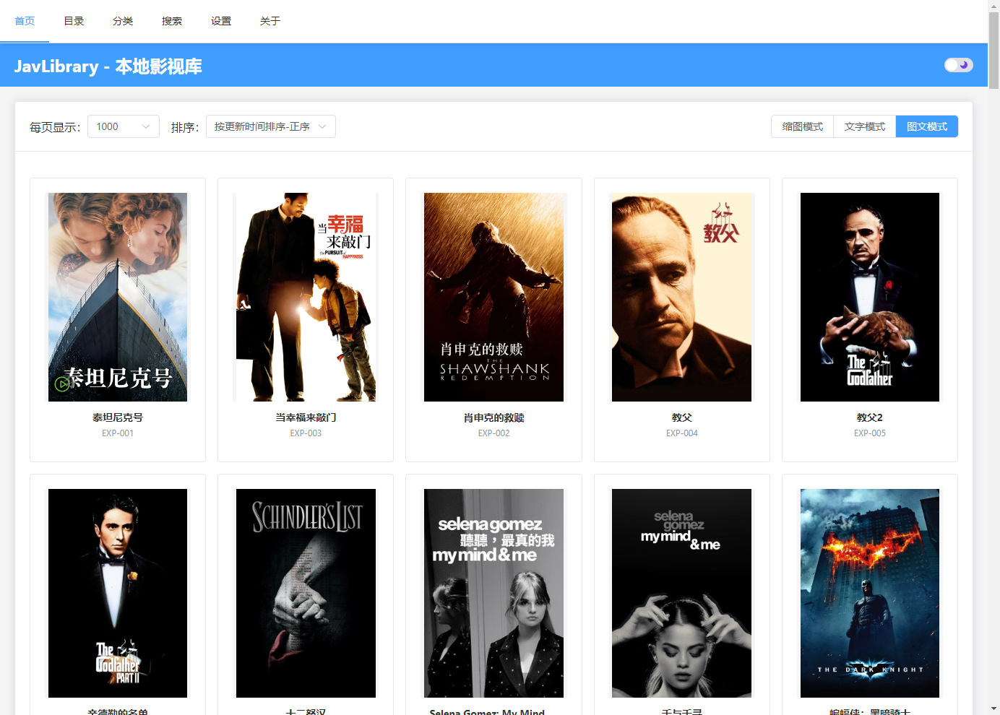
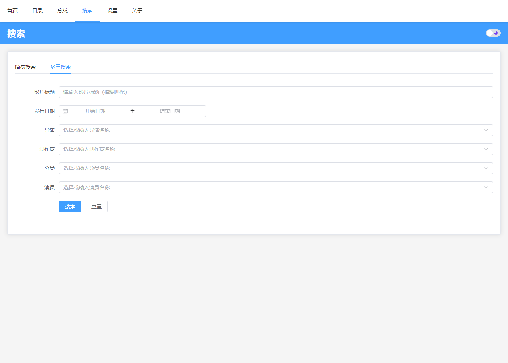
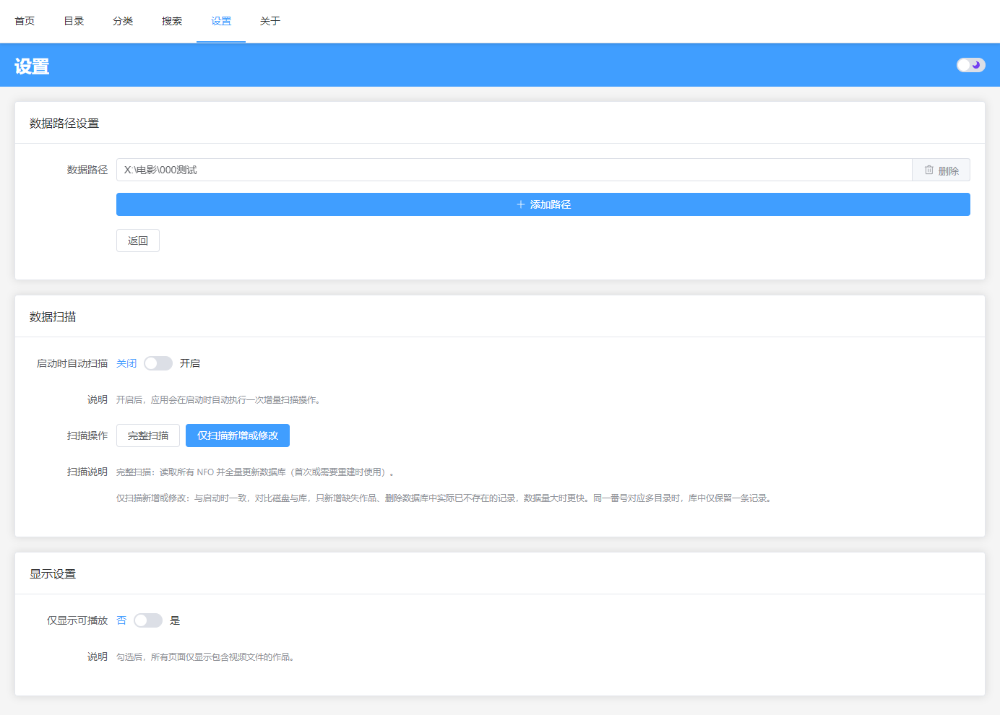

# JavLibrary

**本地影视库管理系统**

由于jellyfin和Emby，以及主流NAS的播放应用对某些小众影片的支持不太友好，所以借助AI自己动手做了一个。

基于 Electron + Vue 3 构建的桌面应用，自动扫描和解析本地 NFO 元数据文件，提供多维度浏览、搜索和管理功能（需搭配其它元数据刮削工具使用）。

**版本**: v2.5.1

## 功能特点

- 📁 **自动扫描**: 自动扫描本地 data 文件夹中的 NFO 元数据文件，构建本地数据库
- 🔍 **多维度浏览**: 支持按演员、导演、制作商、分类、系列等多维度浏览影片
- 🔎 **高级搜索**: 提供简易搜索和多重搜索两种模式，支持多条件组合查询
- 📊 **数据统计**: 显示每个目录的可播放数量和总数量统计
- 🔄 **数据同步**: 启动时与磁盘 diff 自动增删库；设置页支持「完整扫描」与「仅扫描新增或修改」，扫描完成后展示结果列表
- ⚙️ **多路径支持**: 支持添加多个数据文件夹路径，数据叠加管理
- 🎬 **视频播放**: 播放器开发不在本项目的考虑范围内，为调用系统默认播放器播放
- ✏️ **数据编辑**: 支持编辑影片信息，仅更新 NFO 中修改的字段、保留其余内容（建议使用前备份 NFO，确认符合预期后再批量使用）
- 📄 **页面状态管理**: 自动保存和恢复分页、排序、滚动位置等页面状态
- 🖼️ **图片优化**: 智能图片加载管理，支持优先级队列和分批加载
- 📜 **详情页扩展**: 作品简介、预览图展示，可点击轮播放大

## 界面预览


*首页*


*影片详情*


*组合搜索*


*应用设置*

## 技术栈

- **Electron**: 跨平台桌面应用框架
- **Vue 3**: 前端框架
- **Vite**: 快速构建工具
- **SQLite**: 轻量级本地数据库
- **Sequelize**: Node.js ORM 框架
- **Element Plus**: Vue 3 UI 组件库

## 开发环境要求

- Node.js 18+
- npm 或 pnpm

## 安装依赖

```bash
# 安装根目录依赖
npm install

# 安装前端依赖
cd frontend
npm install
cd ..
```

## 开发运行

```bash
# 同时启动 Electron 和前端开发服务器
npm run dev

# 或者分别启动
npm run dev:electron  # 启动 Electron
npm run dev:frontend  # 启动前端开发服务器（端口 5173）
```

## 构建打包

```bash
# 构建前端
npm run build:frontend

# 打包 Electron 应用
npm run build:electron

# 快速构建（跳过 sqlite3 重新编译）
npm run build:quick
```

## 项目结构

```
JavLibrary/
├── electron/              # Electron 主进程
│   ├── main.js           # 主进程入口文件
│   ├── preload.js        # 预加载脚本（安全IPC通信）
│   └── src/
│       ├── config/       # 配置文件
│       ├── models/       # 数据模型
│       ├── services/     # 业务逻辑层
│       ├── ipc/          # IPC 处理器
│       └── utils/        # 工具函数
├── frontend/             # 前端应用（渲染进程）
│   ├── src/
│   │   ├── views/        # 页面组件
│   │   ├── components/   # 公共组件
│   │   ├── stores/       # 状态管理
│   │   ├── router/       # 路由配置
│   │   └── utils/        # 工具函数
│   └── vite.config.js
└── package.json
```

## 使用说明

### 首次启动

1. 启动应用后，系统会提示选择 data 文件夹路径
2. 选择包含 NFO 文件的文件夹
3. 在设置页面点击"开始扫描数据文件夹"进行初始数据导入

### 数据格式

data 文件夹结构示例：
```
data/
├── 文件夹目录1/
│   ├── 作品文件夹1/
│   │   ├── poster.jpg    # 封面（或 *ps.* / 文件名含 poster，如 MKMP-393-C-poster.jpg）
│   │   ├── fanart.jpg    # 海报（或 *pl.* / 文件名含 fanart，如 MKMP-393-C-fanart.jpg）
│   │   ├── xxx.nfo       # 元数据文件（任意 .nfo 后缀均可）
│   │   └── video.mp4     # 视频文件（可选）
│   └── ...
└── ...
```

- **NFO**：支持任意文件名的 `.nfo` 文件，不限于 `movie.nfo`
- **封面/海报**：优先识别以 `ps`/`pl` 结尾的图片；其次按关键词匹配，文件名含 `poster` 为封面、含 `fanart` 为海报（支持 `poster.jpg`、`番号-分类-poster.jpg` 等）
- **识别码**：NFO 中可使用 `<uniqueid>` 或 `<num>` 标签，编辑时按原格式更新

### 主要功能

- **目录浏览**: 在"目录"页面通过下拉框切换不同类型的目录（演员、文件目录、导演、制作商、分类）
- **搜索功能**: 在"搜索"页面使用简易搜索或多重搜索查找影片
- **影片详情**: 点击影片进入详情页，可查看完整信息、编辑数据、播放视频
- **设置管理**: 在"设置"页面配置数据路径、扫描数据、调整显示和同步设置

### 配置说明

应用开箱即用，如需自定义配置：

- **数据路径**: 在设置页面添加或删除数据文件夹路径（支持多路径）
- **显示设置**: 开启"仅显示可播放"可过滤掉没有视频文件的影片
- **实时同步**: 开启"启用实时同步"可自动监听文件变化并同步数据（关闭可提升性能）

## 问题反馈

如果使用中遇到了 Bug 或问题，欢迎通过以下方式反馈：

- 提交 Issue（提问前请先搜索是否已有类似问题）
- 想要更多类型影片支持？请提供对应的nfo文件或门户网站
- 联系开发者：x248336024@vip.qq.com

## 参与贡献

此项目完全借助 AI 进行开发。如果你想要帮助改进这个项目，欢迎通过以下方式参与：

- 帮忙设计个logo？
- 报告 Bug 或提出功能建议
- 帮助测试和验证功能
- 提交 Pull Request
- 点个 Star 支持一下

## License

本项目采用 [GPL-3.0 License](LICENSE) 开源协议。

### 重要声明

- 本软件仅供学习和技术交流使用
- 请勿在微博、微信等墙内的公共社交平台上宣传此项目
- 用户在使用本软件时，请遵守当地法律法规
- 禁止将本软件用于商业用途

---

**注意**: 本软件仅供学习和技术交流使用，请遵守当地法律法规。
